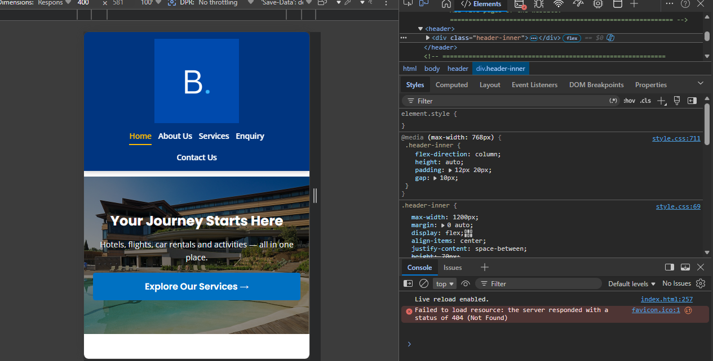
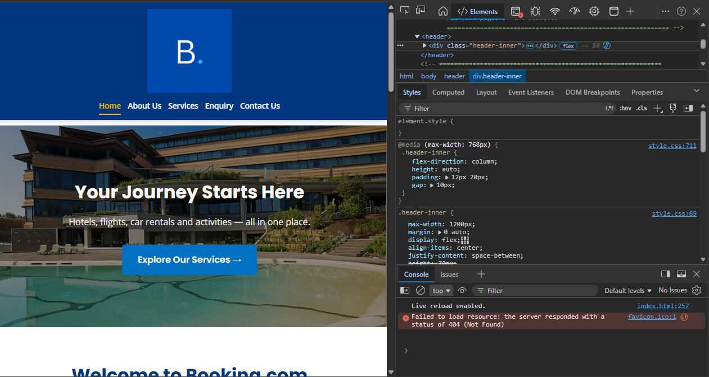
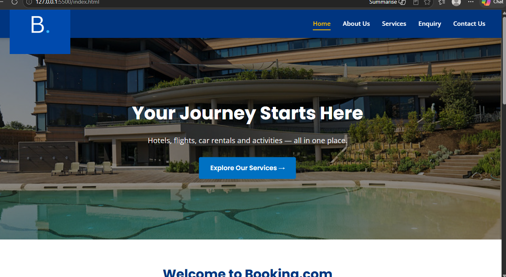

# Booking.com Website — WEDE5020 POE Part 1, Part 2 & Part 3

---

## Student Information

| Field | Detail |
|---|---|
| **Student Name** | [Angel Qosha] |
| **Student Number** | [St10533417]
| **Module** | Web Development (Introduction) — WEDE5020 |
| **Assessment** | POE — Part 1 (Foundation), Part 2 (CSS + Fixes) & Part 3 (Functionality, SEO, Deployment) |
| **Year** | 2026 |

---

## Project Overview

This project is a five-page website built for **Booking.com**, one of the world's leading online travel platforms. Booking.com was founded in Amsterdam in 1996 and connects millions of travellers with accommodation, flights, car rentals and activities across more than 220 countries.

The website was developed as part of the WEDE5020 Portfolio of Evidence (POE). It demonstrates foundational HTML5 structure, semantic markup, CSS styling, JavaScript form validation, and responsive design principles.

---

## Website Goals and Objectives

| Goal | KPI (Key Performance Indicator) |
|---|---|
| Increase brand awareness and online visibility | Number of unique monthly visitors |
| Allow users to learn about Booking.com services | Average time spent on the Services page |
| Enable visitors to submit travel enquiries | Number of enquiry form submissions per month |
| Provide contact information and office locations | Number of contact form submissions |
| Showcase the company's history and team | Bounce rate on the About Us page |

---

## Key Features and Functionality

- **5 fully linked HTML pages**: index.html, about_us.html, services_and_products.html, enquiry.html, contact_us.html
- **Consistent header and footer** across all pages with working navigation
- **Mobile hamburger navigation menu** with JavaScript toggle (Part 2 fix)
- **Hero banner** on the homepage with a call-to-action button
- **Services grid** displaying accommodation, flights and activities cards
- **Services accordion with live search/filter** on the Services page (Part 3)
- **Photo gallery with interactive lightbox** on the About Us page (Part 3)
- **Interactive Leaflet map** plotting all four office locations on the Contact page, alongside four embedded Google Maps (Part 3)
- **Enquiry form** with JavaScript validation and a dynamic cost/availability response based on the enquiry subject (Part 3)
- **Contact form** with JavaScript validation and automatic email compilation via `mailto:` (Part 3)
- **Footer mini-form validation** on all five pages (Part 3)
- **4 embedded Google Maps** showing global office locations (Amsterdam, Johannesburg, Jeddah, Seville)
- **Embedded YouTube video** on the services page
- **External CSS stylesheet** (css/style.css) linked to all pages
- **External JavaScript file** (js/main.js) linked to all pages
- **SEO meta tags** (description + keywords) on every page
- **robots.txt and sitemap.xml** for search engine crawling (Part 3)
- **Proper HTML5 semantic elements** (`<header>`, `<nav>`, `<main>`, `<section>`, `<footer>`)

---

## Sitemap

```
Booking.com Website
│
├── index.html              (Homepage)
│   ├── Hero banner
│   ├── Introduction section
│   └── Featured services grid
│
├── about_us.html           (About Us)
│   ├── Organisation history
│   ├── Mission statement
│   ├── Vision statement
│   └── Key team members
│
├── services_and_products.html  (Services)
│   ├── Accommodation
│   ├── Flights
│   ├── Activities
│   ├── Catering
│   ├── Wellness & Spa
│   └── YouTube video embed
│
├── enquiry.html            (Enquiry)
│   ├── Contact details panel
│   └── Enquiry form (JS validated)
│
└── contact_us.html         (Contact Us)
    ├── Contact details
    ├── 4 x Google Maps (Amsterdam, JHB, Jeddah, Seville)
    └── Contact form (JS validated)
```

---

## File and Folder Structure

```
BOOKING.COM/
│
├── index.html                      ← Homepage
├── about_us.html                   ← About Us page
├── services_and_products.html      ← Services page
├── enquiry.html                    ← Enquiry form page
├── contact_us.html                 ← Contact page with maps
│
├── css/
│   └── style.css                   ← External stylesheet (all pages)
│
├── js/
│   └── main.js                     ← Form validation + footer handler
│
├── images/
│   ├── logo.png                    ← Booking.com logo (header + footer)
│   ├── hero_image.jpg              ← Homepage hero banner
│   ├── hotel_room.jpg              ← About Us page image
│   ├── accomodation.jpg            ← Services: accommodation
│   ├── flight.jpg                  ← Services: flights
│   ├── activities.jpg              ← Services: activities
│   ├── catering.jpg                ← Services: catering
│   ├── massage.jpg                 ← Services: wellness
│   └── fahim-reza-87GJDfPQNw0-unsplash.jpg  ← Additional asset
│
├── private/
│   ├── mcdonald's first propopsal.docx   ← First proposal (not approved)
│   └── Second proposal booking.com.docx  ← Approved proposal
│
└── README.md                       ← This file
```

---

## Budget

The table below provides a realistic estimated budget for developing, hosting and maintaining the Booking.com website. Figures are based on South African market rates researched from platforms such as Afrihost, Hetzner and Upwork ZA.

| Item | Description | Estimated Cost (ZAR) |
|---|---|---|
| **Domain Name** | .com domain registration via Afrihost — 1 year | R 299 |
| **Web Hosting** | Shared hosting plan (Hetzner SA) — 1 year | R 1 188 |
| **SSL Certificate** | Let's Encrypt free SSL via hosting provider | R 0 |
| **Front-end Development** | HTML, CSS and JavaScript — 90 hours @ R 250/hr | R 22 500 |
| **Graphic Design** | Logo refinement and image sourcing | R 3 500 |
| **Content Writing** | Copywriting for 5 pages | R 2 500 |
| **Testing and Debugging** | Cross-browser and device testing | R 1 500 |
| **Year 1 Maintenance** | Monthly updates and security patches (12 months) | R 6 000 |
| **Contingency (10%)** | Buffer for unexpected costs | R 3 749 |
| **TOTAL** | | **R 41 236** |

> *Note: As this is an academic exercise, no real funds were spent. Budget figures are based on publicly available pricing from South African service providers and are intended to reflect realistic market rates (Afrihost, 2025; Hetzner, 2025).*

---

## Timeline and Milestones

| Milestone | Task | Target Date |
|---|---|---|
| **Part 1 — Week 1** | Project setup, GitHub repo, HTML structure for all 5 pages | Week 1 of Term |
| **Part 1 — Week 2** | Content research, images sourced, navigation linked | Week 2 of Term |
| **Part 1 Submission** | Submit HTML files, README, project proposal | Part 1 Due Date |
| **Part 2 — Week 1** | Apply feedback from Part 1, fix HTML issues | Week after Part 1 results |
| **Part 2 — Week 2** | Create external CSS stylesheet, style all 5 pages | Week 5 of Term |
| **Part 2 — Week 3** | Responsive design (media queries), final testing | Week 6 of Term |
| **Part 2 Submission** | Submit updated repo with CSS + fixes documented | Part 2 Due Date |
| **Part 3 — Week 1** | Add JavaScript functionality and SEO optimisation | Week 8 of Term |
| **Part 3 Submission** | Final submission with all three parts complete | Part 3 Due Date |

---

## Deployment

> **Live URL:**  https://angel-create-dot.github.io/WEDE-5020/

Once deployed, update the live URL in the following three files so canonical tags, the sitemap and robots.txt all point to the correct live address:
1. **All 5 HTML files** — update the `<link rel="canonical" href="...">` tag in the `<head>` of each page.
2. **sitemap.xml** — replace all five `<loc>` placeholder URLs with the live domain.
3. **robots.txt** — update the `Sitemap:` line with the live domain.

---

## Part 1 Details

### Pages Created
Five HTML pages were created as required by the brief:
1. `index.html` — Homepage with hero, intro and services grid
2. `about_us.html` — History, mission, vision and team members
3. `services_and_products.html` — Detailed breakdown of all services
4. `enquiry.html` — Booking/travel enquiry form
5. `contact_us.html` — Contact details, 4 Google Maps, contact form

### HTML Standards Applied
- All pages use correct HTML5 `<!DOCTYPE html>` declaration
- Semantic elements used throughout: `<header>`, `<nav>`, `<main>`, `<section>`, `<footer>`
- All navigation links correctly reference `.html` file extensions
- All images include descriptive `alt` attributes for accessibility
- All form fields use `<label>` elements with matching `for` and `id` attributes
- HTML comments added to every page explaining each section

---

## Part 2 Details — Changes Based on Part 1 Feedback

The following issues identified in Part 1 marking were corrected in Part 2:

### 1. Website Planning Fixed
- Added a comprehensive **Sitemap** section to this README showing all pages and their content hierarchy
- Updated the **Website Goals and Objectives** section with specific, measurable KPIs
- Added a detailed **Timeline and Milestones** table aligned to submission dates

### 2. File and Folder Structure Fixed
- Created and populated `css/style.css` (was empty in Part 1)
- Created and populated `js/main.js` (was empty in Part 1)
- Moved `Second proposal booking.com.docx` from the root folder into `private/` where proposal documents belong
- Root folder now contains only HTML files; assets are correctly separated into `css/`, `js/` and `images/` subfolders

### 3. Budget Fixed
- Added a detailed, realistic budget table with 9 line items
- Costs are based on actual South African market rates (Afrihost, Hetzner, Upwork ZA)
- Includes development, hosting, design, content, testing, maintenance and contingency
- Cited sources provided in the References section below

### 4. HTML Structure and Basic Content Fixed
- **Removed all `<table>` elements used for navigation** — replaced with proper `<ul><li><a>` navigation lists styled with CSS
- **Removed deprecated `<font>` tags** — typography now controlled entirely by CSS
- **Removed invalid `<bold>` tag** from index.html
- **Fixed broken navigation links** in index.html (`href="contact_us"` → `href="contact_us.html"`, etc.)
- **Fixed broken `<textarea>` tag** in enquiry.html (was `<name="textarea message"...>`)
- **Added `<main>` element** to about_us.html and contact_us.html (was missing)
- **Added `<footer>` element** to all pages (was missing or malformed)
- **Added SEO meta description and keywords** to all five pages
- **Added extensive HTML comments** to every section on every page
- **Added CSS link** (`<link rel="stylesheet" href="css/style.css">`) to all pages
- **Added JS link** (`<script src="js/main.js"></script>`) to all pages
- **Added comprehensive page content** to services_and_products.html (was only images with no descriptions)
- **Added `class="active"`** to the correct navigation link on each page

---

## Changelog

All changes are listed in reverse chronological order (newest first).

### [Part 3] — 2026

**[2026-06-17] — Interactive Elements, Forms, SEO and Functionality**

- **Services Accordion (services_and_products.html):** Converted the five static service rows (Accommodation, Flights, Activities, Catering, Wellness) into an accessible accordion. Each panel is controlled by a `<button>` with `aria-expanded` and `aria-controls`, toggled via `js/main.js`. Panels are visible by default if JavaScript fails to load (progressive enhancement).
- **Services Search/Filter (services_and_products.html):** Added a live search input above the accordion. Typing filters which service panels are shown by matching against each panel's title and description text, and automatically expands any matching panel. A result count updates as the visitor types.
- **Gallery with Lightbox (about_us.html):** Added a new Gallery section with 8 images from the existing image library. Clicking any thumbnail opens a full-screen lightbox overlay with Previous/Next/Close controls, keyboard navigation (arrow keys, Escape), and click-outside-to-close.
- **Interactive Map (contact_us.html):** Added a Leaflet.js map (via CDN) plotting all four global office locations (Amsterdam, Johannesburg, Jeddah, Seville) on a single interactive map with clickable markers and popups, positioned above the four existing individual Google Maps embeds.
- **Enquiry Form Validation and Processing (enquiry.html):** Implemented `submitEnquiry()` in `js/main.js`. Validates Full Name, Email, Subject and Message on submission, displaying inline error messages for invalid/empty fields. On success, generates a dynamic response with estimated cost and availability information based on keywords detected in the Subject field (accommodation, flights, activities, catering, or wellness).
- **Contact Form Validation and Processing (contact_us.html):** Implemented `submitContact()` in `js/main.js`. Validates Name, Email and Message fields, compiles the submitted information into an email body, and opens a pre-filled `mailto:` link addressed to support@booking.com so the visitor's own email client sends the message.
- **Footer Mini-Form Validation (all pages):** Implemented `submitFooterForm()` in `js/main.js` to validate the Quick Enquiry form present in the footer of all five pages (Name, Email format, Message required), with an inline success message and no page reload.
- **SEO — robots.txt:** Created at the project root, allowing all crawlers and pointing to the sitemap.
- **SEO — sitemap.xml:** Created at the project root listing all five pages with priority and change-frequency metadata.
- **SEO — Canonical tags:** Added a `<link rel="canonical">` tag to the `<head>` of all five pages, pointing to each page's preferred URL to prevent duplicate-content issues with search engines.
- **Deployment section added to README:** Documented the live URL placeholder and the three files (HTML canonical tags, sitemap.xml, robots.txt) that must be updated with the real domain once the site is deployed.
- **CSS additions:** Added new styles for the accordion, search bar, gallery grid, lightbox overlay, interactive map container, and form input error states (`.input-error`), plus responsive adjustments for all of the above at the existing 768px and 480px breakpoints.

### [Part 2 Feedback Fixes] — 2026

**[2026-06-17] — Responsive Navigation Menu and Typography Fixes**
- **Navigation Menu (was 0/5 — "No navigation menu adjustments made"):** Added a mobile hamburger toggle button (`.nav-toggle`) inside `<nav>` on all five pages. Created `js/main.js` to toggle an `.open` class on the nav list when the button is clicked, and to auto-close the menu when a link is tapped. On screens ≤768px, the nav list is hidden by default and displays as a full-width vertical dropdown only when opened.
- **Typography (was 0/5 — "No typography adjustments made. Text elements do not adapt to different screen sizes"):** Added root-level `html { font-size }` scaling inside both media queries (93.75% at ≤768px, 87.5% at ≤480px) so that all rem-based text across the site — headings, paragraphs, list items, nav links, buttons — scales down proportionally at each breakpoint, instead of relying on isolated fixes to a handful of headings. Adjusted `line-height` on body text and headings for readability at smaller sizes.
- Updated `.header-inner` so the logo and hamburger sit side by side on tablet, with the nav dropdown appearing below.

### [Part 2] — 2026

**[2026-05-26] — Part 2 CSS and Structural Fixes**
- Created `css/style.css` with full styling for all pages (header, nav, hero, sections, footer, forms, buttons)
- Added tablet responsive design using media query at max-width 768px: stacked header, 2-column services grid, single column layouts for about, enquiry and contact sections, single column footer
- Added mobile responsive design using media query at max-width 480px: single column services grid, reduced hero height and font sizes, full width buttons, reduced padding throughout




- Created `js/main.js` with validated form submission for enquiry.html and contact_us.html
- Fixed all navigation links across all five pages (removed missing `.html` extensions)
- Replaced `<table>`-based navigation with semantic `<ul><li><a>` navigation
- Removed deprecated `<font>` and invalid `<bold>` HTML tags
- Fixed broken `<textarea>` tag in enquiry.html
- Added `<main>` element to about_us.html and contact_us.html
- Added proper `<footer>` element to all pages with sitemap, contact form and details
- Added SEO `<meta name="description">` and `<meta name="keywords">` to all five pages
- Added HTML comments to every section on every page
- Added detailed content (descriptions, lists) to services_and_products.html
- Moved `Second proposal booking.com.docx` from root to `private/` folder
- Updated README.md with comprehensive sitemap, file structure, budget and timeline

### [Part 1] — 2026

**[2026-04-15] — Initial HTML structure created**
- Created five HTML pages: index.html, about_us.html, services_and_products.html, enquiry.html, contact_us.html
- Added logo, header and navigation to all pages
- Added hero image to index.html
- Added organisation history, mission, vision and team to about_us.html
- Added services images and YouTube embed to services_and_products.html
- Added enquiry form to enquiry.html
- Added Google Maps (4 locations) and contact form to contact_us.html
- Created `images/` folder with all image assets
- Submitted GitHub repository link

---

## References

Afrihost. (2025). *Domain registration pricing*. Available at: https://www.afrihost.com/domains [Accessed 20 May 2026].

Booking.com. (2025). *About Booking.com*. Available at: https://www.booking.com/content/about.html [Accessed 10 April 2026].

Booking Holdings. (2025). *Annual report 2024*. Available at: https://ir.bookingholdings.com [Accessed 10 April 2026].

Google Fonts. (2025). *Poppins and Open Sans typefaces*. Available at: https://fonts.google.com [Accessed 15 April 2026].

Hetzner South Africa. (2025). *Web hosting plans and pricing*. Available at: https://www.hetzner.co.za/hosting [Accessed 20 May 2026].

Leaflet. (2025). *Leaflet — an open-source JavaScript library for interactive maps*. Available at: https://leafletjs.com [Accessed 17 June 2026].

OpenStreetMap. (2025). *OpenStreetMap contributors — map tile data*. Available at: https://www.openstreetmap.org/copyright [Accessed 17 June 2026].

MDN Web Docs. (2025). *HTML elements reference*. Mozilla. Available at: https://developer.mozilla.org/en-US/docs/Web/HTML/Element [Accessed 15 April 2026].

MDN Web Docs. (2025). *CSS reference*. Mozilla. Available at: https://developer.mozilla.org/en-US/docs/Web/CSS/Reference [Accessed 20 May 2026].

Unsplash. (2025). *Free high-resolution photos — fahim-reza-87GJDfPQNw0*. Available at: https://unsplash.com [Accessed 12 April 2026].

MDN Web Docs. (2025). *CSS media queries*. Mozilla. Available at: https://developer.mozilla.org/en-US/docs/Web/CSS/CSS_media_queries/Using_media_queries [Accessed 26 May 2026].

MDN Web Docs. (2025). *CSS Flexbox layout*. Mozilla. Available at: https://developer.mozilla.org/en-US/docs/Web/CSS/CSS_flexible_box_layout [Accessed 26 May 2026].

MDN Web Docs. (2025). *CSS Grid layout*. Mozilla. Available at: https://developer.mozilla.org/en-US/docs/Web/CSS/CSS_grid_layout [Accessed 26 May 2026].

W3Schools. (2025). *CSS media queries*. Available at: https://www.w3schools.com/css/css3_mediaqueries.asp [Accessed 26 May 2026].

W3Schools. (2025). *HTML tutorial*. Available at: https://www.w3schools.com/html [Accessed 15 April 2026].

